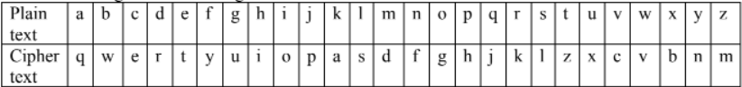

# Monoalphabetic-Substitution-Encryption
Monoalphabetic substitution encryption, each lowercase alphabetic letter is substituted by another letter according to the following table:

Spaces are omitted if entered with uppercase characters and numbers being ignored.
